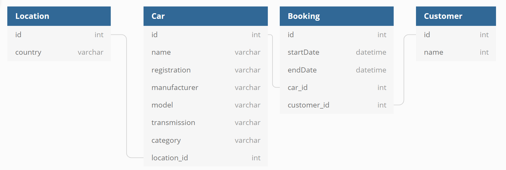

# Background
"Blocks car rental" is a fictional car rental firm that enables basic car rental administration for the owner - Neil. 

Today, Neil can use the software to manage his bookings, he can;
- Make new bookings;
- Cancel bookings, and;
- View bookings.

# Database
Below is an overview of the schema used by Blocks car rental.

# The problem - car washes
Neil wants to provide a way of directing his staff to a car so that they can drive it to the car wash for an upcoming rental. Neil has a big forecourt, and many employees, he estimates that if 2 employees are directed to the same car for washing he could lose up to 10 minutes of time per day - so it is important to him that when his employees are looking for a new car that they don't duplicate the work. 

Neil wants to track his car washing through the software through some sort of database queueing mechanism. 
